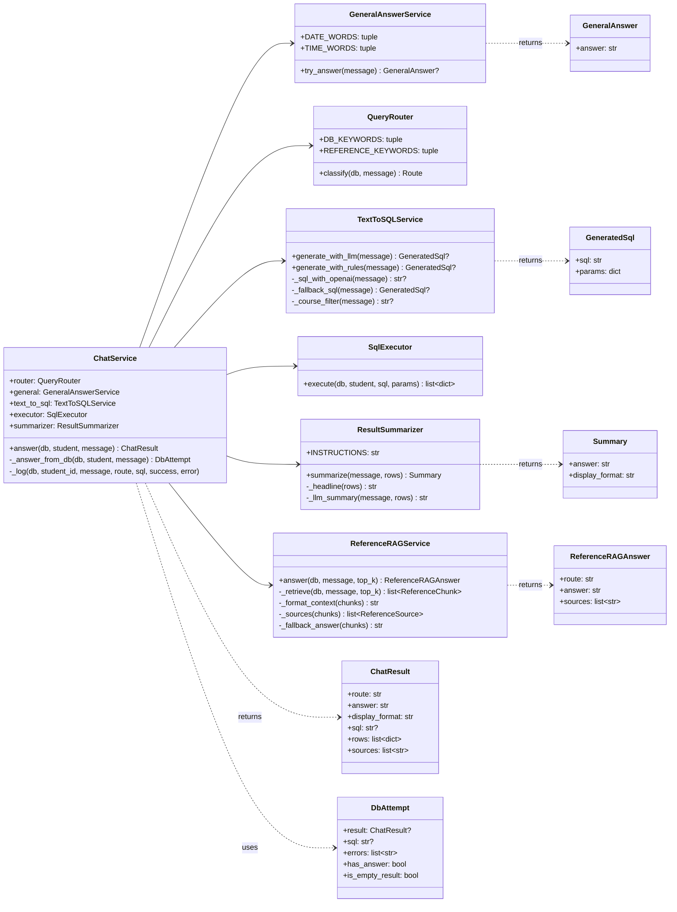
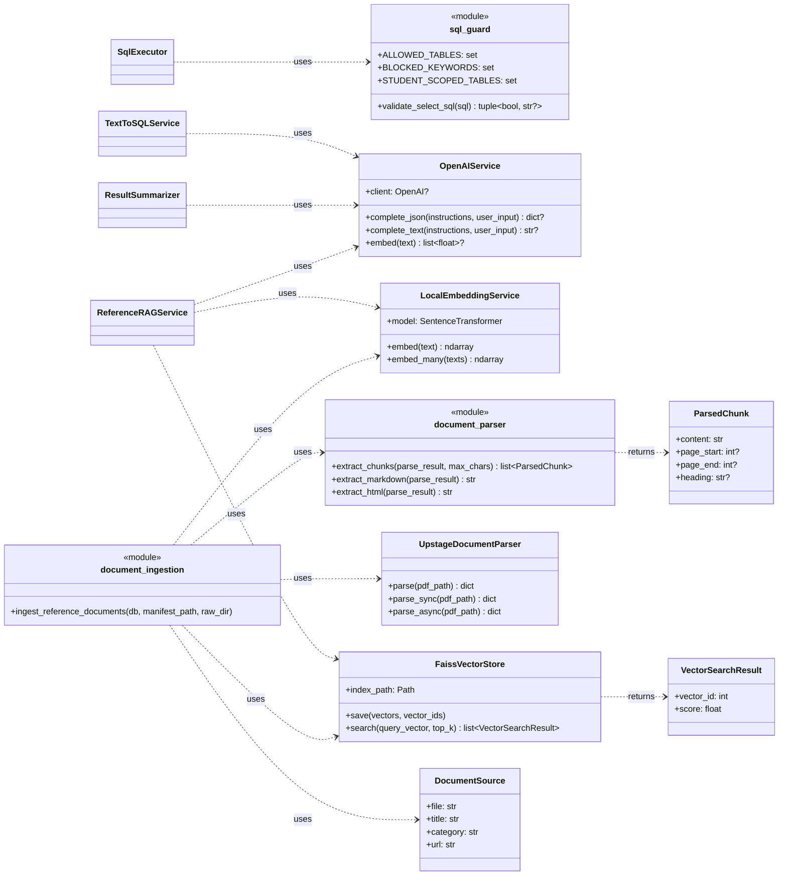
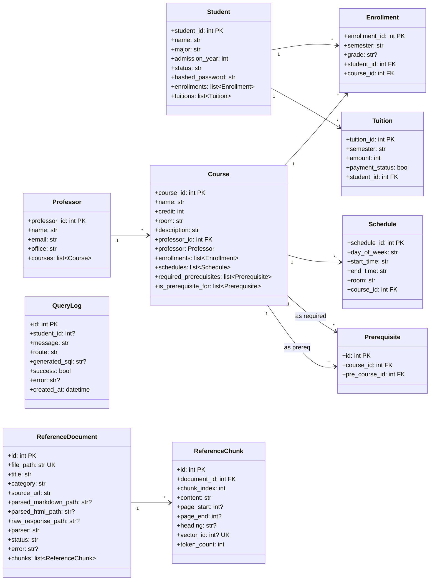
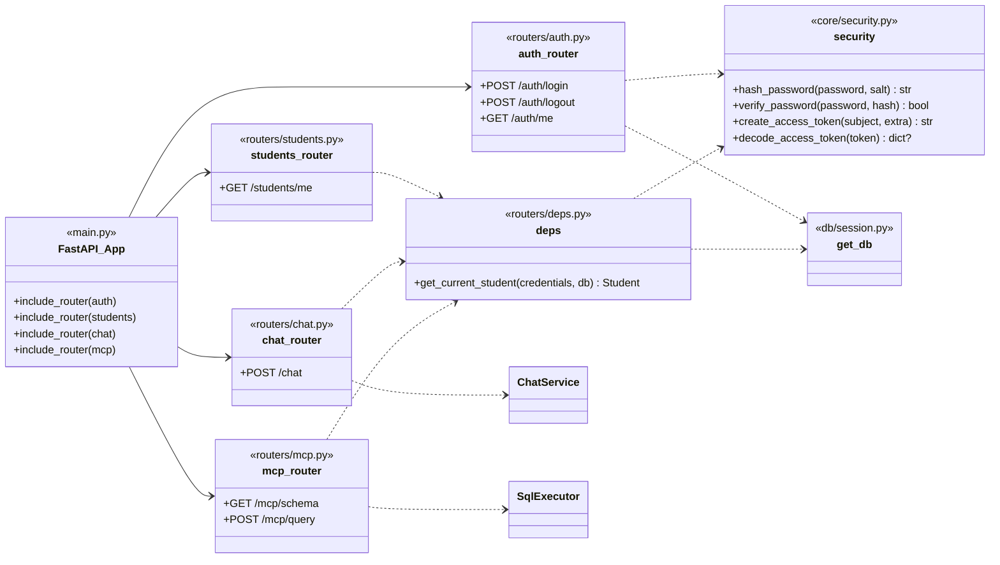

# 클래스 다이어그램

> 작성일: 2026-05-02
> 대상: KU-Bot 백엔드 (`backend/app/`)

---

## 1. 서비스 계층 (분해된 6개 서비스 + DTO)

---

## 2. 보조 모듈 (보안 가드 · 외부 API · RAG 인프라)

---

## 3. ORM 모델 (`app/models/academic.py`)

---

## 4. 라우터·의존성 계층

