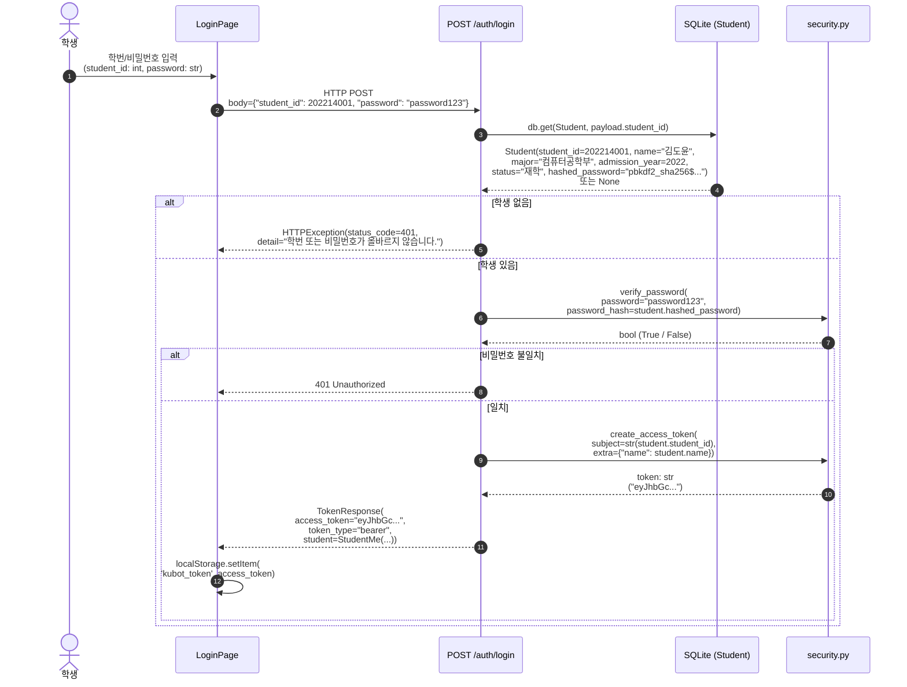
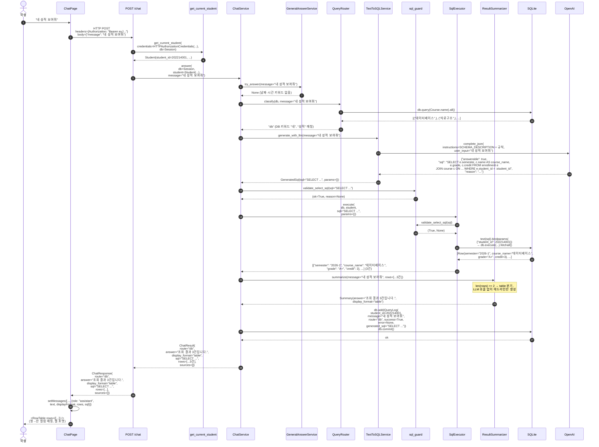
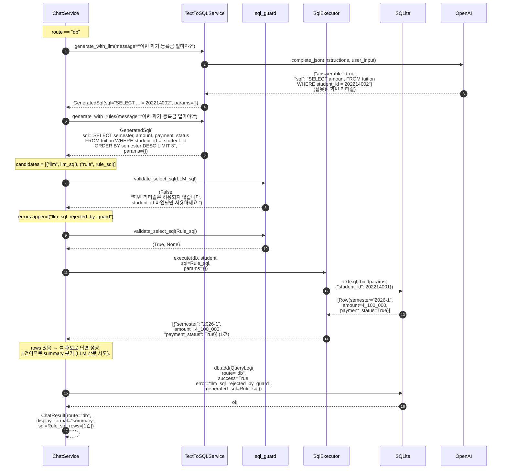
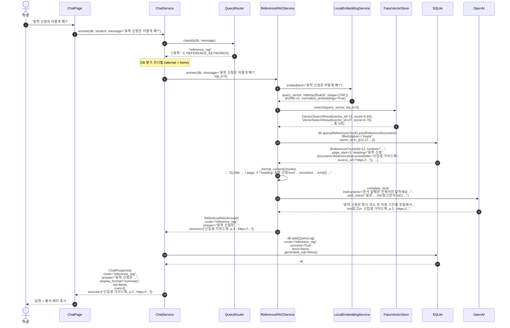
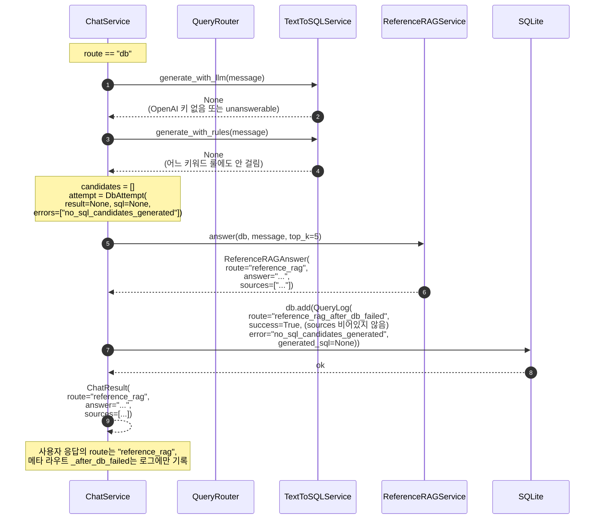
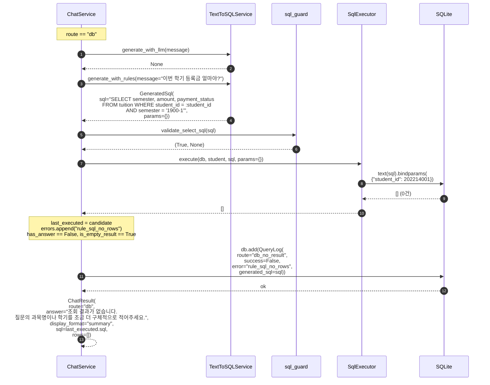
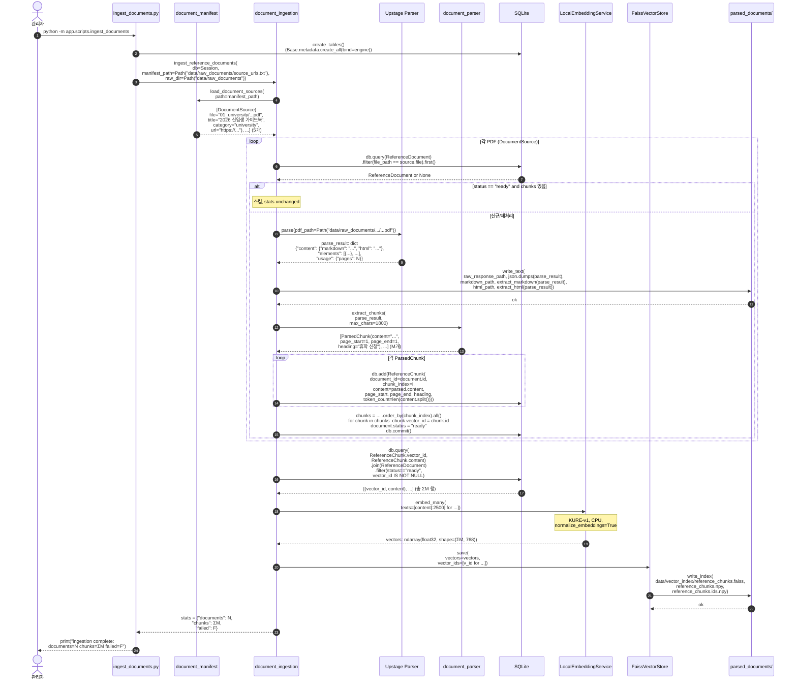

# 시퀀스 다이어그램

> 작성일: 2026-05-02
> 대상: KU-Bot 핵심 흐름 7종 (로그인, DB 성공, LLM→룰 폴백, RAG 1차, DB 실패 후 RAG 폴백, DB 빈 결과, 인제스트)
>
> 모든 화살표에 메서드 시그니처와 실제 반환값 형태를 함께 표기합니다.

---

## 1. 로그인

---

## 2. `/chat` — DB 분기 (LLM 성공 경로)

---

## 3. `/chat` — DB 분기에서 LLM 실패 → 룰 fallback (B 변경)

---

## 4. `/chat` — RAG 분기 (1차 선택)

---

## 5. `/chat` — DB 실패 후 RAG 폴백 (route 메타: `reference_rag_after_db_failed`)

---

## 6. `/chat` — DB 빈 결과 (route 메타: `db_no_result`)

---

## 7. 문서 인제스트 (오프라인 배치)

