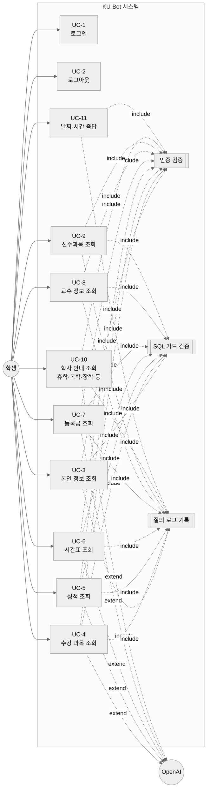

# 유즈케이스 다이어그램

> 작성일: 2026-05-02
> 대상: KU-Bot 학생 전용 학사정보 챗봇

---

## 1. 행위자

| 행위자 | 설명 |
|--------|------|
| **학생** | 학번/비밀번호로 로그인하여 본인의 학사정보 또는 일반 학사 안내를 자연어로 조회하는 주 사용자 |
| **OpenAI** (외부 시스템) | Text-to-SQL 변환, 자연어 답변 합성, RAG 답변 합성에 사용되는 LLM |
| **Upstage Document Parse** (외부 시스템) | 인제스트 단계에서만 사용되는 PDF 파서 |
| **관리자** | 오프라인으로 인제스트 스크립트를 실행해 참고문서를 색인 |

---

## 2. 학생 유즈케이스 다이어그램

---

## 3. 유즈케이스 서술서 (요약)

| ID | 이름 | 사전조건 | 흐름 | 결과 |
|----|------|----------|------|------|
| UC-1 | 로그인 | — | 학번/비밀번호 입력 → PBKDF2 검증 → JWT 발급 | `Authorization: Bearer` 토큰 보유 |
| UC-2 | 로그아웃 | 로그인됨 | 클라이언트가 `localStorage`에서 토큰 삭제 | 인증 만료 |
| UC-3 | 본인 정보 조회 | 로그인됨 | "내 정보 알려줘" → 라우터 `db` → 룰 SQL → 1행 → 산문 | 학번·이름·전공 등 |
| UC-4 | 수강 과목 조회 | 로그인됨 | "내 수강 과목 알려줘" → `db` → 룰 SQL → 다건 → 표 | 과목 목록 표 |
| UC-5 | 성적 조회 | 로그인됨 | "내 성적 보여줘" → `db` → 룰 SQL → 다건 → 표 | 학기·과목·성적·학점 |
| UC-6 | 시간표 조회 | 로그인됨 | "오늘 시간표 알려줘" → `db` → 룰 SQL → 다건 → 표 | 요일·시작·종료·강의실 |
| UC-7 | 등록금 조회 | 로그인됨 | "이번 학기 등록금 얼마야?" → `db` → 룰 SQL → 1행 → 산문 | 학기·금액·납부 상태 |
| UC-8 | 교수 정보 조회 | 로그인됨 | "데이터베이스 교수님 이메일 알려줘" → `db` → 과목명 + LIKE 바인딩 | 교수명·이메일·연구실 |
| UC-9 | 선수과목 조회 | 로그인됨 | "운영체제 선수과목 알려줘" → `db` → 룰 SQL | 과목별 선수과목 |
| UC-10 | 학사 안내 조회 | 로그인됨 | "휴학 신청 어떻게 해?" → 라우터 `reference_rag` → FAISS → LLM | 청크 기반 답변 + 출처 |
| UC-11 | 날짜·시간 즉답 | 로그인됨 | "오늘 며칠?" → `general` → KST 즉답 | DB/LLM 호출 없이 즉답 |

### 예외 흐름

| ID | 예외 | 결과 |
|----|------|------|
| EXC-1 | 미인증 호출 (토큰 없음/만료) | 401 |
| EXC-2 | LLM SQL이 가드에 거부 | 룰 fallback 시도, 그것도 실패 시 RAG로 폴백 |
| EXC-3 | 두 후보 SQL 모두 빈 결과 | "조회 결과가 없습니다…" 안내 |
| EXC-4 | RAG 인덱스에 매칭 없음 | "관련 내용을 찾지 못했습니다" 안내 + `success=False` 로깅 |
